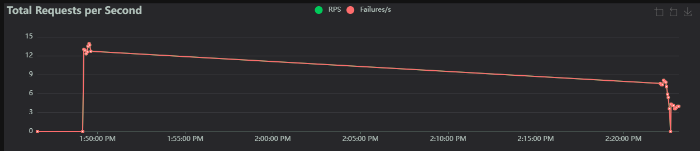
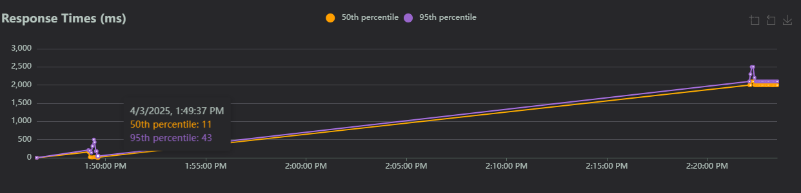

# Higher Education Student Performance Prediction System Pipe Line

## Overview
This project implements a machine learning pipeline for predicting student performance in higher education. The system uses historical student data to predict academic outcomes, helping educational institutions identify students who might need additional support or intervention.

## Live demo site
[Student dropout](https://ml-pipeline-le2q.onrender.com/)

## video link
[youtube-video](https://youtu.be/DyDCOaVwEJQ)

## Features
- Data preprocessing and feature engineering pipeline
- Machine learning model training with class imbalance handling
- FastAPI-based REST API for predictions
- Interactive web interface for model predictions
- Comprehensive model evaluation metrics
- Docker containerization support


## Project Structure
```
.
├── data/               # Data directory for storing raw and processed datasets
├── dataset/            # Directory for specific dataset files or models
├── models/             # Trained models and artifacts
├── node_modules/       # Node.js dependencies (if using Node.js)
├── notebook/           # Jupyter notebooks for analysis and experimentation
├── src/                # Source code for the application
│   ├── preprocessing/  # Data preprocessing modules
│   ├── training/       # Model training scripts
│   └── evaluation/     # Model evaluation scripts
├── static/             # Static files for web interface (images, CSS, etc.)
├── __pycache__/        # Python bytecode files (automatically generated)
├── docker-compose.yml  # Docker Compose configuration for multi-container setups
├── Dockerfile          # Dockerfile for containerizing the app
├── Dockerfile.locust   # Locust Dockerfile for load testing
├── latency.png         # Image file for latency visualization (or graph)
├── locustfile.py       # Script for load testing using Locust
├── README.md           # Project description and instructions
├── requirements.txt    # List of Python dependencies
├── response.png        # Image file for response time visualization (or graph)
├── split_data.py       # Data splitting script (e.g., train/test split)
├── test_pipeline.py    # Unit tests for the machine learning pipeline
├── package-lock.json   # npm lock file (if using Node.js)
├── package.json        # npm package definition (if using Node.js)
└── yarn.lock           # Yarn lock file (if using Yarn package manager)

```

## Technical Stack
- **Backend Framework**: FastAPI
- **Machine Learning**: scikit-learn, TensorFlow
- **Data Processing**: pandas, numpy
- **Web Interface**: HTML, CSS, JavaScript
- **Containerization**: Docker
- **API Documentation**: OpenAPI (Swagger UI)

## Setup and Installation

### Prerequisites
- Python 3.8 or higher
- Docker (optional, for containerized deployment)
- Git

### Installation Steps

1. Clone the repository:
```bash
git clone https://github.com/MKangabire/student_dropout.git
cd ml_pipeline
```

2. Create and activate a virtual environment:
```bash
python -m venv venv
# On Windows:
venv\Scripts\activate
# On Unix or MacOS:
source venv/bin/activate
```

3. Install dependencies:
```bash
pip install -r requirements.txt
```

4. Set up environment variables:
```bash
cp .env.example .env
# Edit .env with your configuration
```

### Running the Application

1. Start the FastAPI server:
```bash
uvicorn src.api.main:app --host 0.0.0.0 --port 8000
```

2. Access the following endpoints:
- API Documentation: `http://localhost:8000/docs`
- Web Interface: `http://localhost:8000`

### Running with Docker
1. Build the Docker image:
```bash
docker build -t student_dropout .
```

2. Run the container:
```bash
docker run -p 5000:5000 student_dropout
```

The application will be available at `http://localhost:5000`

## Model Evaluation Metrics
- Accuracy
- Precision
- Recall
- F1-Score
- ROC-AUC
- Confusion Matrix

## Load Testing with Locust
I conducted load testing on my model's `/api/predict` endpoint using Locust to evaluate its performance under stress. The test simulated 30 concurrent users sending requests to a single Docker container deployment.

### Running Locust Tests
To run the load tests locally:
```bash
locust -f locust_latency.py --host=https://student-drop-out.onrender.com/
```


#### Detailed Observations

##### Latency and Response Times

*Figure 1: Response time distribution and RPS over time*

##### Performance Metrics

*Figure 2: Detailed performance statistics from load testing*

This chart shows response times (in milliseconds) over time for a system under load testing.

Two key percentiles are tracked:

50th percentile (median) → (orange) Represents the typical response time for half of the requests.

95th percentile → (purple) Indicates the upper range where most (95%) of responses fall under.

Observations:

Initially, response times were low and stable (~11ms for the 50th percentile).

Over time, response times gradually increased, indicating performance degradation as load increased.

Around 2:20 PM, there was a spike, suggesting a potential bottleneck or increased load affecting response times.


## References
- Dataset source: [Student Dropout Analysis and Prediction](https://www.kaggle.com/datasets/abdullah0a/student-dropout-analysis-and-prediction-dataset?resource=download)